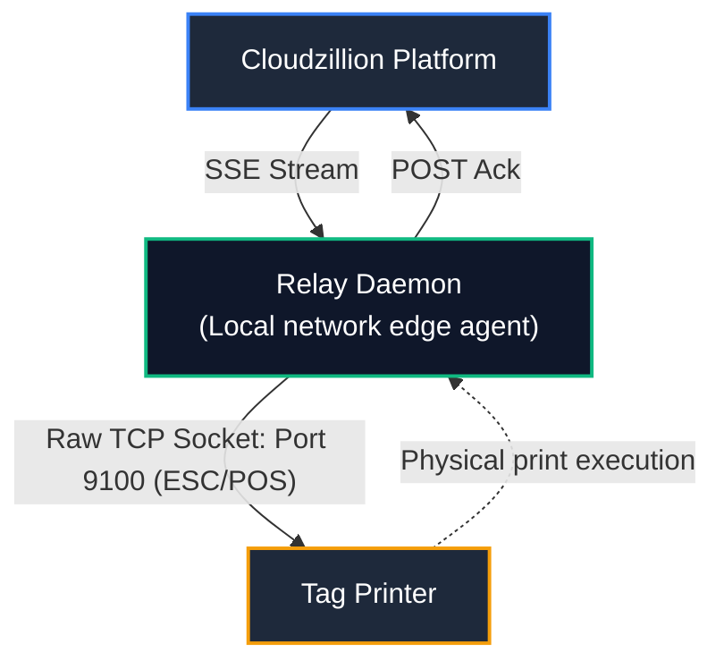

# Cloudzillion Relay Daemon

Lightweight on-premises hardware relay daemon that bridges Cloudzillion cloud print queues to local network thermal printers in real time via Server-Sent Events (SSE).

---

## Architecture Overview



```text
[ Cloudzillion Platform ]
          │  (SSE Stream)
          ▼
   [ Relay Daemon ] (Local network edge agent)
          │  (Raw TCP Socket: Port 9100 / ESC/POS)
          ▼
[ Thermal Tag Printer ]
          │  (Physical print execution)
          ▼
   [ Relay Daemon ]
          │  (POST Ack)
          ▼
[ Cloudzillion Platform ] ──> (Tag state updated to PRINTED)
```

- **Resilient Connectivity:** Automatic reconnection with exponential backoff and continuous heartbeat validation.
- **Direct Hardware Communication:** Sends raw ESC/POS command buffers straight to local thermal printer IPs via raw TCP sockets (port 9100).
- **Zero Inbound Ports:** Establishes outbound-only HTTPS/WSS connections—no firewall punch-through, port forwarding, or public IP needed on-site.

---

## Quick Start (Docker Compose)

The recommended deployment method for store devices (Raspberry Pi, Linux mini-PC, etc.) is Docker Compose using the multi-arch public image (`ghcr.io/cloudzillion/relay`).

### 1. Download Compose Configuration

```bash
curl -O [https://raw.githubusercontent.com/cloudzillion/relay/main/docker-compose.yml](https://raw.githubusercontent.com/cloudzillion/relay/main/docker-compose.yml)
```

### 2. Configure Environment

Create a `.env` file alongside `docker-compose.yml`:

```env
STATION_ID=00000000-0000-0000-0000-000000000000
STATION_API_KEY=your_raw_station_secret_here
CLOUD_BASE_URL=[https://[TENANT].prozillion.com](https://[TENANT].prozillion.com)
PRINTER_TIMEOUT_MS=5000
LOG_LEVEL=info
```

### 3. Launch Daemon

```bash
docker compose up -d
```

Check the logs to verify connection:

```bash
docker compose logs -f
```

---

## Configuration Reference

| Variable | Required | Default | Description |
| :--- | :---: | :---: | :--- |
| `STATION_ID` | **Yes** | — | UUID of the registered station in Cloudzillion. |
| `STATION_API_KEY` | **Yes** | — | Plaintext secret key matching the station's hashed secret. |
| `CLOUD_BASE_URL` | **Yes** | — | Base domain of the tenant application (e.g. `https://[TENANT].prozillion.com`). |
| `PRINTER_TIMEOUT_MS` | No | `5000` | Socket connection timeout when attempting to reach thermal printer. |
| `LOG_LEVEL` | No | `info` | Logging verbosity (`debug`, `info`, `warn`, `error`). |

---

## Local Development

### Prerequisites

- Node.js 20+
- npm

### Setup

```bash
# Clone repository
git clone git@github.com:cloudzillion/relay.git
cd relay

# Install dependencies
npm install

# Run in development mode with hot reload
npm run dev
```

### Build

```bash
npm run build
npm start
```

---

## License

MIT © Cloudzillion
