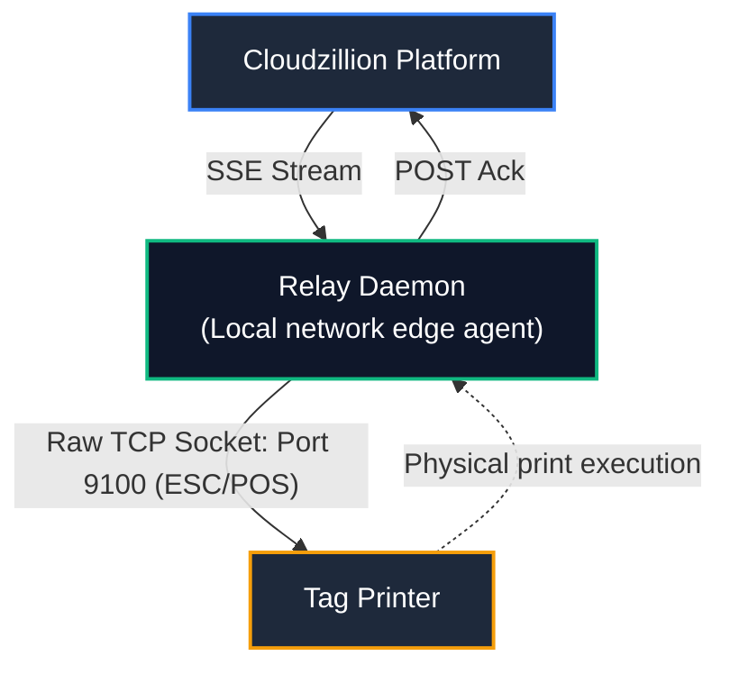

# Cloudzillion Relay Daemon

Lightweight on-premises hardware relay daemon that bridges Cloudzillion cloud print queues to local network printers (Epson TM-U220 impact dot-matrix and thermal tag printers) in real time via Server-Sent Events (SSE).

---

## Architecture Overview



```text
[ Cloudzillion Platform ]
          │  (SSE Stream)
          ▼
   [ Relay Daemon ] (Local network edge agent)
          │  (Raw TCP Socket: Port 9100 / ESC/POS)
          ▼
[ Epson TM-U220 / Impact Matrix Tag Printer ]
          │  (Physical print execution)
          ▼
   [ Relay Daemon ]
          │  (POST Ack)
          ▼
[ Cloudzillion Platform ] ──> (Tag state updated to PRINTED)
```

- **Resilient Connectivity:** Automatic reconnection with exponential backoff and continuous heartbeat validation.
- **Direct Hardware Communication:** Sends raw ESC/POS command buffers straight to local thermal printer IPs via raw TCP sockets (port 9100).
- **Zero Inbound Ports:** Establishes outbound-only HTTPS/WSS connections—no firewall punch-through, port forwarding, or public IP needed on-site.

---

## Quick Start (Docker Compose)

The recommended deployment method for store devices (Raspberry Pi, Linux mini-PC, etc.) is Docker Compose using the multi-arch public image (`ghcr.io/cloudzillion/relay`).

### 1. Download Compose Configuration

```bash
curl -O [https://raw.githubusercontent.com/cloudzillion/relay/main/docker-compose.yml](https://raw.githubusercontent.com/cloudzillion/relay/main/docker-compose.yml)
```

### 2. Configure Environment

Create a `.env` file alongside `docker-compose.yml`:

```env
CZ_STATION_ID=00000000-0000-0000-0000-000000000000
CZ_STATION_KEY=your_raw_station_secret_here
CZ_SERVER_URL=https://cloudzillion.com
PRINTER_IP=192.168.4.200
PRINTER_PORT=9100
CZ_RECONNECT_INTERVAL_MS=5000
LOG_LEVEL=info
```

### 3. Launch Daemon

```bash
docker compose up -d
```

Check the logs to verify connection:

```bash
docker compose logs -f
```

---

## Configuration Reference

| Variable | Fallback Alias | Required | Default | Description |
| --- | --- | --- | --- | --- |
| `CZ_STATION_ID` | `STATION_ID` | **Yes** | — | UUID of the registered station. |
| `CZ_STATION_KEY` | `STATION_API_KEY` | **Yes** | — | Secret key matching the station's hashed secret. |
| `CZ_SERVER_URL` | `CLOUD_BASE_URL` | No | `[https://cloudzillion.com](https://cloudzillion.com)` | Base URL of central platform gateway (bypasses tenant domains). |
| `PRINTER_IP` | — | **Yes** | `192.168.4.200` | Local IPv4 address of the physical printer. |
| `PRINTER_PORT` | — | No | `9100` | Raw TCP port (defaults automatically to 9100). |
| `CZ_RECONNECT_INTERVAL_MS` | — | No | `5000` | Backoff reconnect interval in milliseconds. |
| `LOG_LEVEL` | — | No | `info` | Logging verbosity (`debug`, `info`, `warn`, `error`). |

---

## Local Development

### Prerequisites

- Node.js 20+
- npm

### Setup

```bash
# Clone repository
git clone git@github.com:cloudzillion/relay.git
cd relay

# Install dependencies
npm install

# Run in development mode with hot reload
npm run dev
```

### Build

```bash
npm run build
npm run start
```

---

## License

MIT © Cloudzillion
